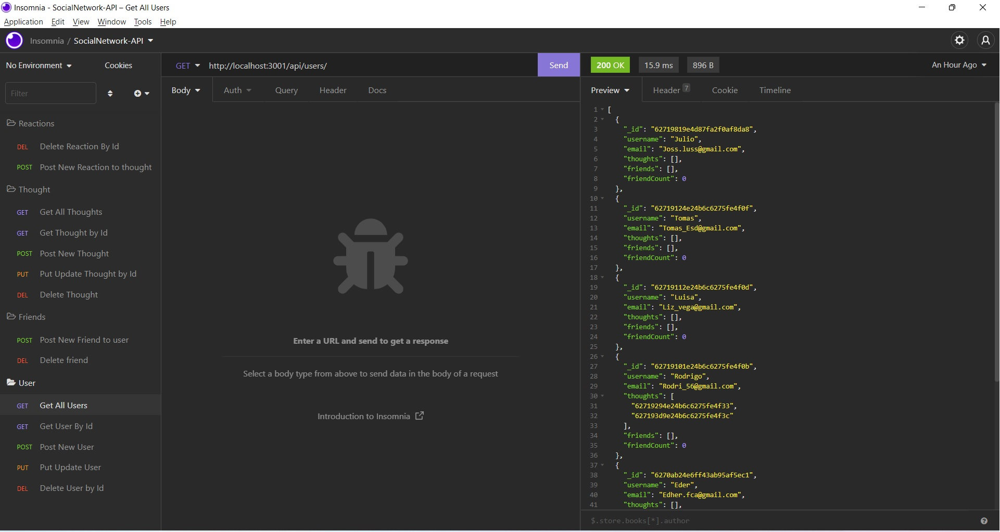
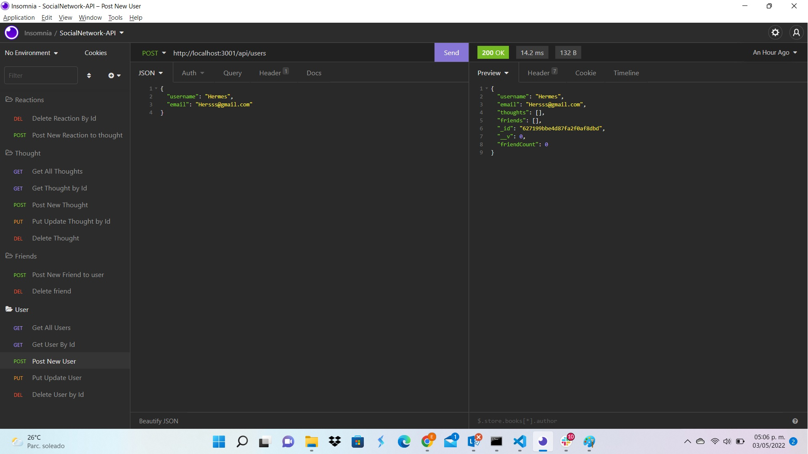
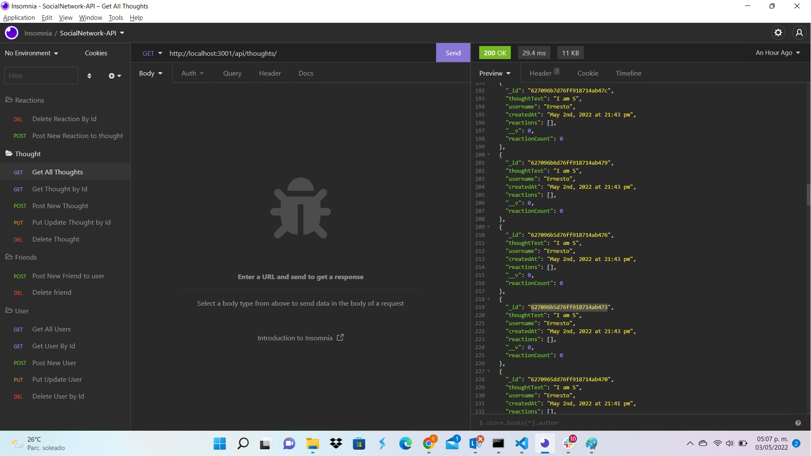
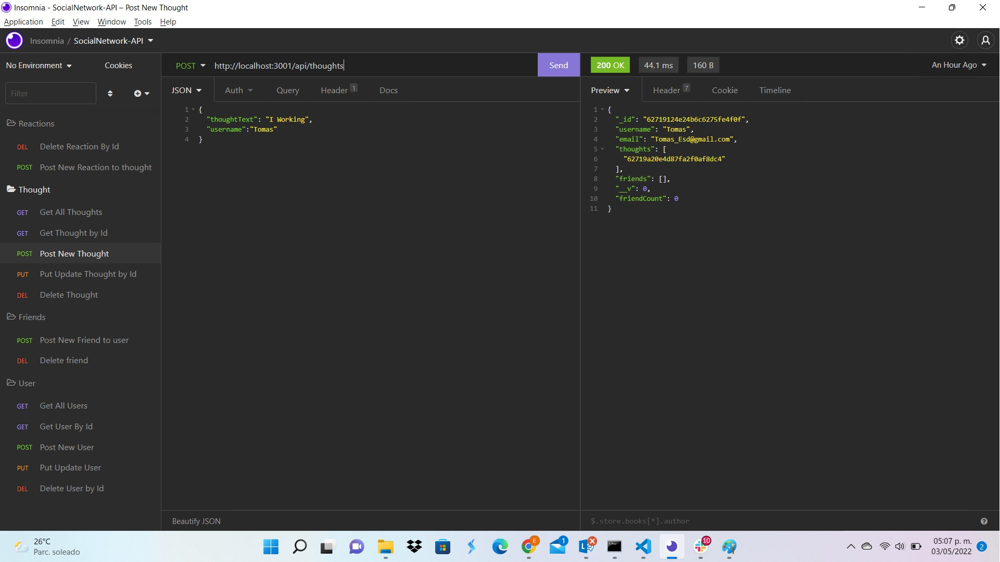

# 18 NoSQL: Social Network API

 Deployed Video: https://drive.google.com/file/d/17GKLgWf-Ifz4F7LbYcRLwjXrCnKGAn3g/view?usp=sharing
## Description

MongoDB is a popular choice for many social networks due to its speed with large amounts of data and flexibility with unstructured data. 

This homework is to build an API for a social network web application where users can share their thoughts, react to friends’ thoughts, and create a friend list. 
So that a website can handle large amounts of unstructured data. This application is build using Express.js for routing, a MongoDB database, and the Mongoose ODM.

The application will be invoked with the following command:
``` 
npm start server.js
``` 
## Table of Contents
- [Author info.](#autor-info) 
- [User Story](#user-story)
- [Acceptance Criteria](#acceptance-criteria)
- [Technologies](#technologies)
- [Mockup](#mock-up)
- [Licencia](#licencia)

## Autor info:
```
 Eder Rodrigo Ramirez Contreras 
 Gitgub: https://github.com/kdher/
 mail: edher.fca@gmail.com
```
## User Story

```md
AS A social media startup
I WANT an API for my social network that uses a NoSQL database
SO THAT my website can handle large amounts of unstructured data
```

## Acceptance Criteria

```md
GIVEN a social network API
WHEN I enter the command to invoke the application
THEN my server is started and the Mongoose models are synced to the MongoDB database
WHEN I open API GET routes in Insomnia for users and thoughts
THEN the data for each of these routes is displayed in a formatted JSON
WHEN I test API POST, PUT, and DELETE routes in Insomnia
THEN I am able to successfully create, update, and delete users and thoughts in my database
WHEN I test API POST and DELETE routes in Insomnia
THEN I am able to successfully create and delete reactions to thoughts and add and remove friends to a user’s friend list
```
## Technologies 
* Node js
* Express js
* MongoDB
* JavaScript
* Insomnia

## Mock Up

The following animations show examples of the application's API routes being tested in Insomnia.




## Licencia
[](https://shields.io)